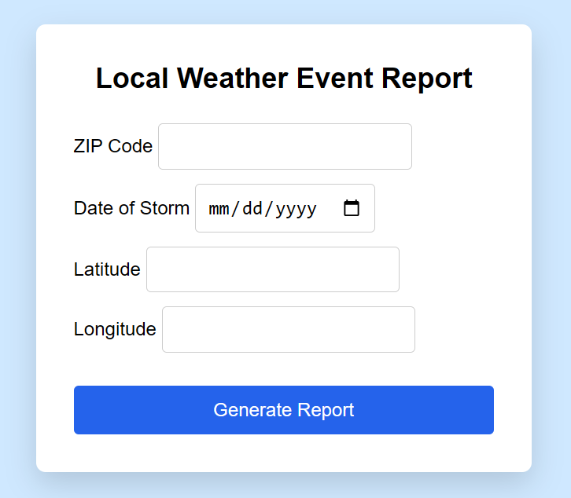
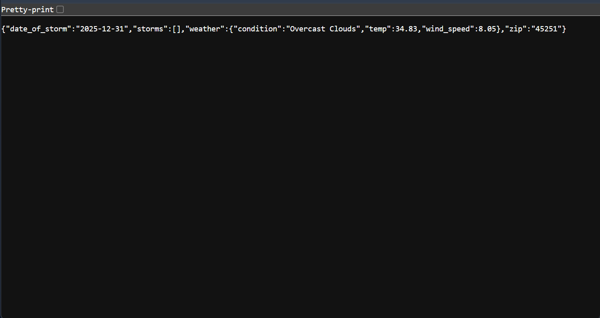

# 🌩️ --- Local Weather Event Report ---

A lightweight backend service that aggregates public weather
and storm event data for a given location and date.

This project demonstrates backend system design, API integration,
environment variable management, and deployment practices.
---

## 📌 Use Case

> “What weather events were recorded near a given location on a specific date?”

This service aggregates publicly available data sources to provide
contextual weather and storm information, such as:

- Local weather conditions
- Reported storm events (hail, wind, etc.)
- Time and location alignment

The output is intended for **informational and technical demonstration purposes only**.
---

## 🧠 How It Works

1. User provides:
   - ZIP code
   - Date 
   - Latitude/Longitude (optional for accuracy)

2. The system fetches:
   - 📍 Live or recent weather data from **OpenWeatherMap**
   - 📄 Optional storm event data from NOAA CSV logs (if provided)

3. It outputs:
   - Structured weather condition data.
   - A list of nearby storm events for the specified date.
   - 📄 To save this report, use 'Print to PDF' or copy and paste.

---

## 🖥️ Web Interface

The application includes a simple web form for submitting requests.

### Screenshot – Web Interface




---

## 📁 File Structure

```
local-weather-event-report/
├── app.py                 # Flask application
├── openweather.py         # OpenWeatherMap API logic
├── noaa_parser.py         # NOAA CSV parsing
├── generate_report.py     # Report formatting helpers
├── static/
│   └── style.css          # UI styling
├── templates/
│   └── index.html         # Web form template
├── sample_noaa_data.csv   # Optional: Example NOAA storm data(not included)
├── requirements.txt
└── README.md
```

---

## 🔧 Setup Instructions

### 1. Get an OpenWeatherMap API Key
  Create a free account at:
  https://openweathermap.org/api

  ---

### 2. Set the API Key as an Environment Variable

  On macOS / Linux:
  ```bash
  export OPENWEATHER_API_KEY=your_api_key_here
  ```
  On Windows (PowerShell):
  ```bash
  setx OPENWEATHER_API_KEY "your_api_key_here"
  ```
  When deploying, set the OPENWEATHER_API_KEY in the platform’s environment variable settings.
  
  ---
  
### 3. Optional: NOAA Storm Event Data

  This application can optionally parse NOAA storm event CSV files
  for historical storm data.

  If no NOAA file is present, the application will continue to function
  normally and return an empty storm list.

  To include NOAA data:
  - Download CSV files from:
    https://www.ncei.noaa.gov/pub/data/swdi/stormevents/csvfiles/
  - Filter by state and year
  - Rename the file to `sample_noaa_data.csv`
  - Place it in the project root directory
   ---
   
### 4. Run the Application Locally:
   ```bash
   python app.py
   ```
   - Open your browser at:
     ```bash
     http://localhost:10000
     ```

---

## 📄 Sample API Response

Example response from the `/weather-report` endpoint:

```json
{
  "date_of_storm": "2025-12-31",
  "zip": "45251",
  "weather": {
    "condition": "Overcast Clouds",
    "temp": 34.83,
    "wind_speed": 8.05
  },
  "storms": []
}
```

---

## 🔄 Future Enhancements

   - 🔁 Auto-fetch NOAA data via FTP
   - 🛰️ Hail size overlays via premium storm data APIs
   - Improved data visualization

---

## ⚖️ Disclaimer

This project provides informational weather data only.
It does not provide insurance, legal, or professional advice.

---


